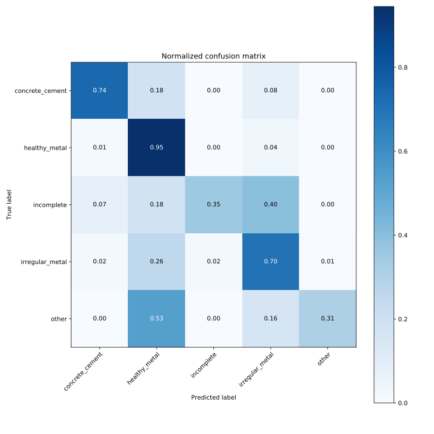

PiratesOfTheCaribbean
==============================

This repository contains our solution (ranked amongst the best 2%) for the competition hosted by Drivendata on roof classification for [Mapping Disaster Risk from Aerial Imagery in the Caribbean][1]. We were given aerial imagery from areas that suffer from different natural hazards, therefore automatically identifying buildings in danger could potentially prevent their damage. 

We have classified roofs into five categories based on their materials: concrete cement, healthy metal, incomplete, irregular metal, other. The metric used in the competition is log loss, and although the dataset is highly imbalanced towards healthy metal, no weights are applied to the metric. Moreover, we were given two datasets: a verified one, and a non-verified one. Analysing the latter we found that the non-verified samples contained a higher ratio of healthy metal samples, probably the runners of the competition already used a neural network that was biased towards healthy metal to produce this non-verified sample. Therefore, we only used the examples from the non-verified set that weren't healthy metal.

Our model uses the pre-trained Nasnet architecture publicly availabe in [tensorflow-hub][2]. We found smaller models tend to perform better in this dataset. We trained Nasnet in 4 folds of the full dataset. To train the model we found using the focal loss [focal-loss][3] instead of categorical cross-entropy produced much better results. It works well, since it naturally deals with the imbalance problem of our dataset. In our experiments, it did it much better than a weighted cross-entropy.

This is the confusion matrix of one of the folds,

Moreover, we found that if we trained the model further, although both the training and validation loss would still go down, the test set log loss would increase. This is probably due to the noise in the labeling of the dataset. We found mislabeled examples in both the verified and non-verified datasets. Although we tried to apply [label smoothing][4], to the examples that our best model missclassified, it didn't decrease our test set loss.

Our best submission is an average of the different folds. We achieved a log loss of 0.4737 in the final test set.

[1]: https://www.drivendata.org/competitions/58/disaster-response-roof-type/ "DrivenData"
[2]: https://blog.tensorflow.org/2018/03/introducing-tensorflow-hub-library.html "tensorflow-hub"
[3]: https://arxiv.org/abs/1708.02002 "focal-loss"
[4]: https://towardsdatascience.com/label-smoothing-making-model-robust-to-incorrect-labels-2fae037ffbd0 "labelsmoothing"
--------

<small>Project based on the <a target="_blank" href="https://drivendata.github.io/cookiecutter-data-science/">cookiecutter data science project template</a>. #cookiecutterdatascience</small>

